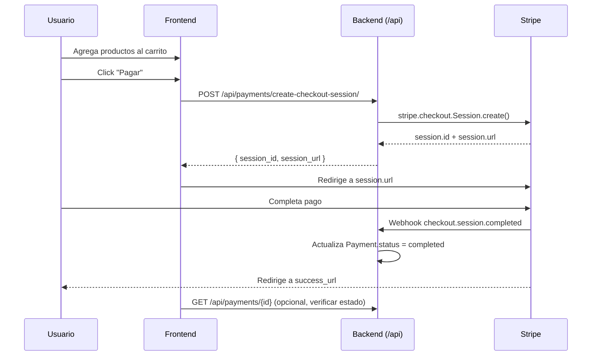

# Integración de Checkout — Frontend

## Flujo general



---

## Endpoints

### 1. Crear sesión de checkout

**`POST /api/payments/create-checkout-session/`** — Público (no requiere JWT).

#### Request body

```json
{
  "items": [
    { "product_id": 1, "quantity": 2 },
    { "product_id": 3, "quantity": 1 }
  ],
  "success_url": "https://tusitio.com/compra-exitosa?session_id={CHECKOUT_SESSION_ID}",
  "cancel_url": "https://tusitio.com/carrito",
  "customer_email": "cliente@example.com"
}
```

| Campo | Tipo | Obligatorio | Descripción |
|-------|------|-------------|-------------|
| `items` | `array` | Sí (min 1) | Lista de productos a comprar |
| `items[].product_id` | `integer` | Sí | ID del producto en nuestra BD |
| `items[].quantity` | `integer` | No (default 1) | Cantidad (mínimo 1) |
| `success_url` | `string` | Sí | URL a la que Stripe redirige tras pago exitoso |
| `cancel_url` | `string` | Sí | URL si el usuario cancela el pago |
| `customer_email` | `string` | No | Email del comprador (opcional) |

> **Importante:** `success_url` y `cancel_url` deben ser URLs absolutas y accesibles desde el navegador del usuario luego de salir de Stripe.

#### Response `201 Created`

```json
{
  "session_id": "cs_test_a1b2c3d4e5f6g7h8i9j0k",
  "session_url": "https://checkout.stripe.com/cs_test_a1b2c3d4e5f6g7h8i9j0k"
}
```

| Campo | Descripción |
|-------|-------------|
| `session_id` | ID de la sesión en Stripe (útil para tracking) |
| `session_url` | URL para redirigir al usuario al formulario de pago de Stripe |

#### Errores

| Status | Significado |
|--------|-------------|
| `400` | Datos inválidos (items vacío, quantity < 1, URLs mal formadas) o producto no sincronizado con Stripe |
| `404` | Producto no encontrado o inactivo |

#### Ejemplo con fetch

```javascript
async function createCheckoutSession(items, successUrl, cancelUrl, email) {
  const response = await fetch(
    'https://api.tusitio.com/api/payments/create-checkout-session/',
    {
      method: 'POST',
      headers: { 'Content-Type': 'application/json' },
      body: JSON.stringify({
        items,
        success_url: successUrl,
        cancel_url: cancelUrl,
        customer_email: email,
      }),
    }
  );

  if (!response.ok) {
    const error = await response.json();
    throw new Error(error.error);
  }

  return response.json();
}

// Uso:
const { session_url, session_id } = await createCheckoutSession(
  [
    { product_id: 1, quantity: 2 },
    { product_id: 3, quantity: 1 },
  ],
  `${window.location.origin}/orden-exitosa`,
  `${window.location.origin}/carrito`,
  'cliente@mail.com'
);

window.location.href = session_url;
```

---

### 2. Listar pagos

**`GET /api/payments/`** — Requiere JWT (solo staff/admin).

#### Response `200 OK`

```json
[
  {
    "id": 1,
    "product": 1,
    "stripe_session_id": "cs_test_abc123",
    "stripe_payment_intent_id": "pi_test_xyz",
    "amount": 2598,
    "currency": "usd",
    "status": "completed",
    "customer_email": "cliente@example.com",
    "is_active": true,
    "created_at": "2026-06-24T02:00:00Z",
    "updated_at": "2026-06-24T02:05:00Z"
  }
]
```

| Campo | Tipo | Descripción |
|-------|------|-------------|
| `id` | int | ID interno del pago |
| `product` | int | ID del producto comprado |
| `stripe_session_id` | string | ID de la sesión Stripe |
| `stripe_payment_intent_id` | string | ID del PaymentIntent (después del webhook) |
| `amount` | int | Monto en centavos (ej: 2598 = $25.98) |
| `currency` | string | Moneda (usd) |
| `status` | string | `pending`, `completed`, `failed`, `refunded` |
| `customer_email` | string | Email del comprador |
| `created_at` | datetime | Fecha de creación |

> **Nota:** Si el checkout tiene múltiples productos, se crea un Payment **por cada producto** con el mismo `stripe_session_id`. `amount` refleja el subtotal de ese producto (unit_price × quantity).

---

### 3. Detalle de pago

**`GET /api/payments/{id}/`** — Requiere JWT.

---

### 4. Webhook (solo para referencia)

**`POST /api/payments/webhook/`** — Solo Stripe llama a este endpoint. No requiere acción del frontend.

---

## Implementación del carrito

### Estructura de datos sugerida (React)

```typescript
interface CartItem {
  product_id: number;
  name: string;
  unit_price: number;
  quantity: number;
  image_url?: string;
  stripe_price_id: string;
}

interface Cart {
  items: CartItem[];
  total: number; // en centavos
}
```

### Flujo completo

1. **Catálogo de productos** → `GET /api/products/` (requiere JWT)
2. **Agregar/quitar del carrito** → estado local (localStorage o estado global)
3. **Checkout** → `POST /api/payments/create-checkout-session/`
4. **Redirigir** a `session_url`
5. **Post-pago** → Stripe redirige a `success_url`
6. **Verificar estado** → (opcional) consultar `GET /api/payments/?stripe_session_id=cs_test_...`

### Ejemplo: componente React

```tsx
import { useState } from 'react';

interface CartItem {
  product_id: number;
  name: string;
  unit_price: number;
  quantity: number;
}

export function CheckoutButton({ items }: { items: CartItem[] }) {
  const [loading, setLoading] = useState(false);

  const handleCheckout = async () => {
    setLoading(true);
    try {
      const lineItems = items.map((item) => ({
        product_id: item.product_id,
        quantity: item.quantity,
      }));

      const res = await fetch(
        `${import.meta.env.VITE_API_URL}/api/payments/create-checkout-session/`,
        {
          method: 'POST',
          headers: { 'Content-Type': 'application/json' },
          body: JSON.stringify({
            items: lineItems,
            success_url: `${window.location.origin}/orden-exitosa`,
            cancel_url: `${window.location.origin}/carrito`,
          }),
        }
      );

      const data = await res.json();
      if (!res.ok) throw new Error(data.error);

      window.location.href = data.session_url;
    } catch (err) {
      console.error('Checkout error:', err);
      alert('Error al iniciar el pago. Intenta de nuevo.');
    } finally {
      setLoading(false);
    }
  };

  return (
    <button onClick={handleCheckout} disabled={loading || items.length === 0}>
      {loading ? 'Redirigiendo a pago...' : 'Pagar con Stripe'}
    </button>
  );
}
```

---

## Manejo de la página de éxito

Tras un pago exitoso, Stripe redirige a la `success_url`. Se recomienda incluir `?session_id={CHECKOUT_SESSION_ID}` en la URL para que el frontend pueda verificar el resultado:

```tsx
// pages/orden-exitosa.tsx
import { useSearchParams } from 'react-router-dom';

export function OrderSuccess() {
  const [params] = useSearchParams();
  const sessionId = params.get('session_id');

  return (
    <div>
      <h1>¡Compra exitosa!</h1>
      <p>ID de transacción: {sessionId}</p>
      <p>Recibirás un email con los detalles de tu pedido.</p>
    </div>
  );
}
```

---

## URLs base

| Ambiente | URL |
|----------|-----|
| Desarrollo local | `http://localhost:8000/api` |
| Producción (Railway) | `https://logistica-api-production.up.railway.app/api` |

---

## Resumen de endpoints

| Método | Endpoint | Auth | Propósito |
|--------|----------|------|-----------|
| `GET` | `/api/products/` | JWT | Listar productos disponibles |
| `GET` | `/api/products/{id}/` | JWT | Detalle de producto |
| `POST` | `/api/payments/create-checkout-session/` | Público | Crear sesión de pago |
| `GET` | `/api/payments/` | JWT | Historial de pagos (staff) |
| `GET` | `/api/payments/{id}/` | JWT | Detalle de pago (staff) |
| `POST` | `/api/payments/webhook/` | Stripe | Webhook (no tocar) |
